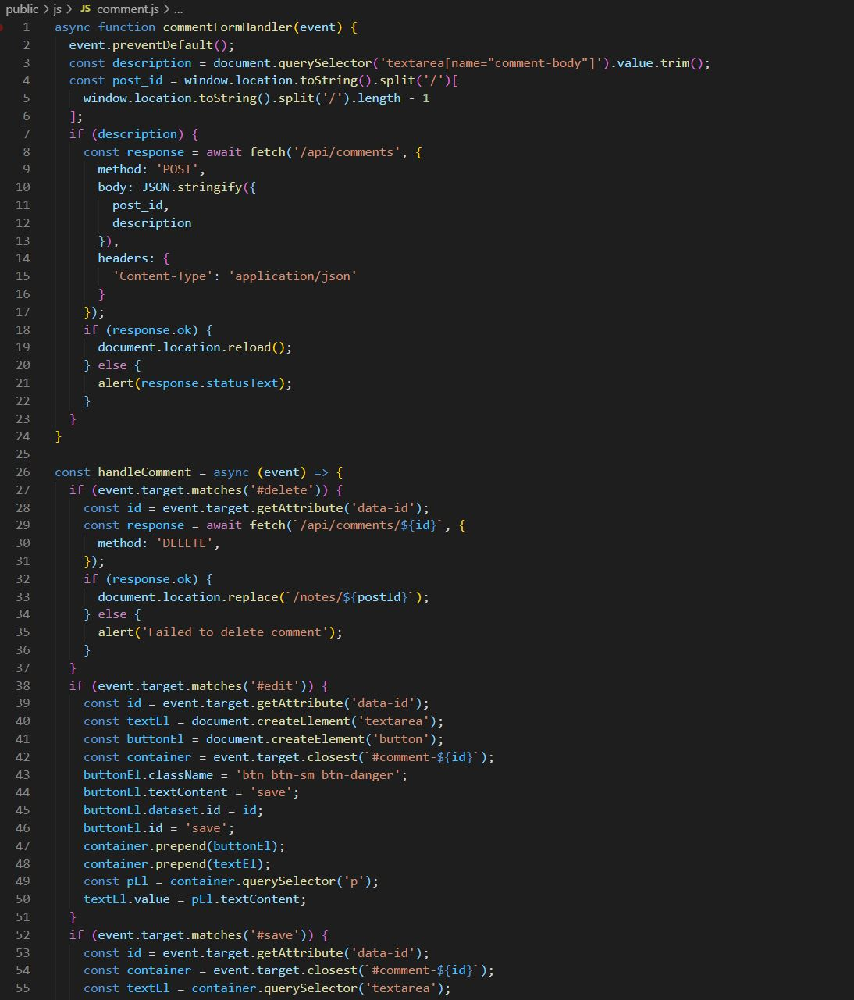
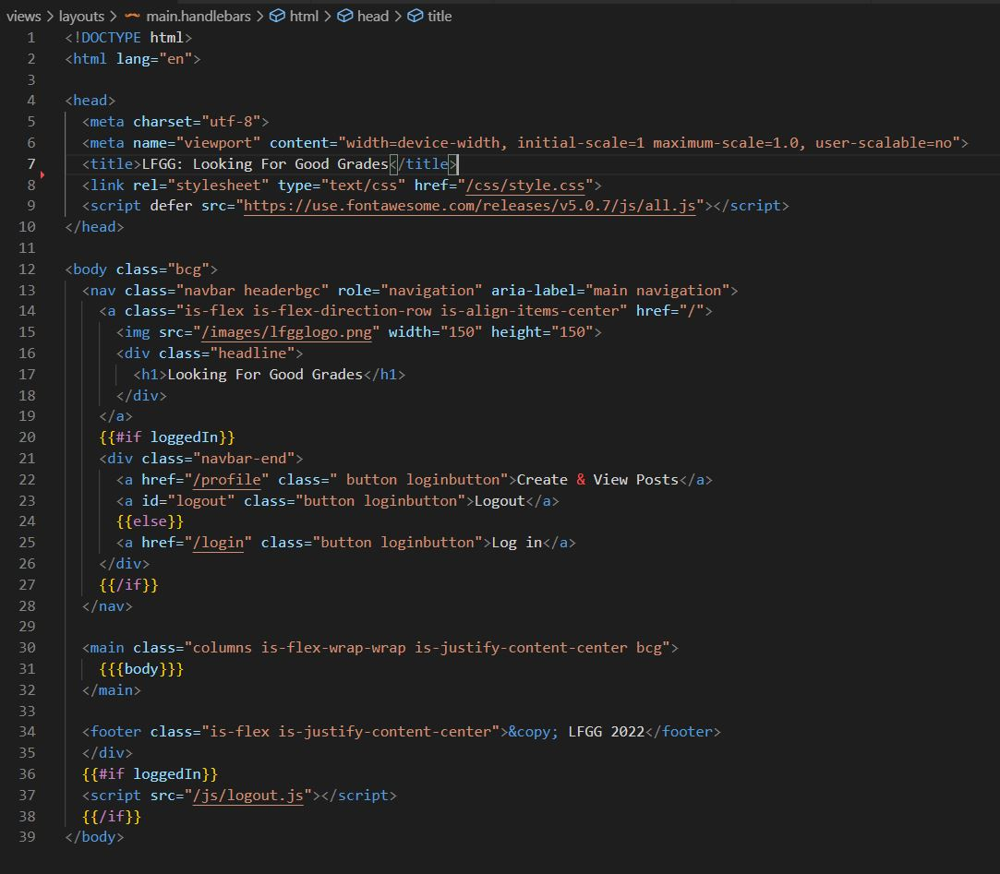
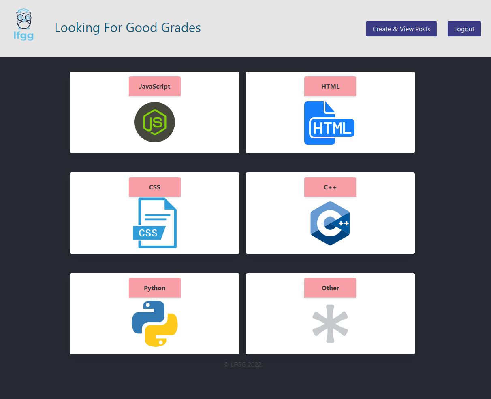
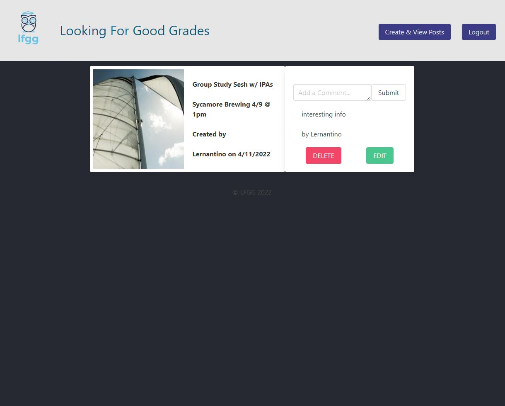

# LFGG - Group Project # 2

## Description

Looking For Good Grades was created as an an easy-to-use portal for users to get together and arrange study groups related to different programming languages. It uses an API-style configuration in order to allow a user to create and login to an account. Once a user is logged in they can navigate the site in order to post a study session or view other members session details. Along with creating a session, a commenting system exists in order to post specific comments regarding a particular session. These comment posts can also be modified or deleted. Specific elements such as meetup location along with study dates and times can all be addressed through LFGG.

## Table of Contents

- [Description](#description)

- [Installation](#installation)

- [Usage](#usage)

- [Contributors](#contributors)

- [Technology](#technology)

- [Links](#links)

## Installation

The application can be executed by performing an npm installation using the "npm install" command. Following the installation, if setup for the first time, the "npm run seed" command should be used to seed database values and allow the site to populate with information. The "npm start" command or "nodemon" command then can be used to launch the server @ http://localhost:3001. Alternatively, the live page can also be accessed through a live heroku server @ https://still-anchorage-60847.herokuapp.com/. This will allow a user to view the website and complete inputs through the individual handlebar-generated html pages.

## Usage

This page is intended for users to quickly and easily create or view study sessions related to 5 common programming languages. JavaScript, HTML, CSS, C++ and Python form the base groups, with an "Others" category also being available, should another subject be required for user input. The site is meant to work for users to meetup either in person or virtually, to allow for as much flexibility as possible. 

Usage and Code Examples:

## Contributors

[Baron Skidmore GitHub Link](https://github.com/IAmSkidd7).

[Emma D Malone GitHub Link](https://github.com/Buggiess).

[Felix Petzsche GitHub Link](https://github.com/felix1805).

[Rich Kim GitHub Link](https://github.com/Rich-afk).

[Sean Duiser GitHub Link](https://github.com/Sean-Duiser).

## Technology

This application uses javascript, JEST, HTML, node.js, express routing, mysql2, node package management and inquirer. It should be viewed by launching a live server in order to access the @ http://localhost:3001 or on a Heroku server @ https://still-anchorage-60847.herokuapp.com/

## Links

[LFGG GitHub Deployed Link](https://rich-afk.github.io/lfgg/).
 
[LFGG GitHub Link](https://github.com/Rich-afk/lfgg).
 
[LFGG Heroku Link](https://still-anchorage-60847.herokuapp.com/).
